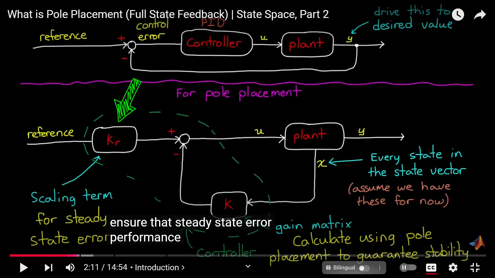

出来混早晚要还的，要捡起老本行，好好学控制！

# 视频网课

## 中文

**b站[Dr.Can](https://space.bilibili.com/230105574)**  

## 英文

Youtube上的 **[MATLAB官方视频](https://www.youtube.com/@MATLAB)**

[Brian Douglas](http://engineeringmedia.com)的视频做的非常棒，但对英语水平可能有一定要求。

# 书籍

## 控制之美 

written by Dr.Can

卷一+卷二 书+代码 